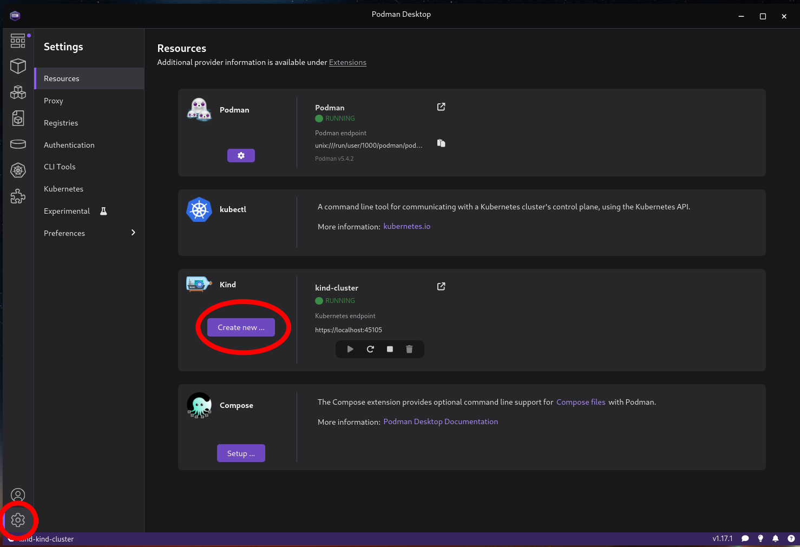

# Escape from Certificate Hell: Managing Trust in Your Kubernetes Cluster

## Setup kind cluster

[Install podman-desktop](https://podman-desktop.io/)



## Deploy our App

```
kubectl apply -f https://raw.githubusercontent.com/mpsOxygen/cdnro-workshop/refs/heads/main/manifests/deployment_and_service.yaml`
```

## Install cert-manager

`helm repo add jetstack https://charts.jetstack.io --force-update`

```
helm install \
  cert-manager jetstack/cert-manager \
  --namespace cert-manager \
  --create-namespace \
  --version v1.17.1 \
  --set crds.enabled=true
```

## Create self signed issuer

`kubectl apply -f https://raw.githubusercontent.com/mpsOxygen/cdnro-workshop/refs/heads/main/manifests/certmanager_ClusterIssuer_selfsinged.yaml`


## Create self signed CA

`kubectl apply -f https://raw.githubusercontent.com/mpsOxygen/cdnro-workshop/refs/heads/main/manifests/certmanager_Certificate_selfsigned.yaml`


## Create CA issuer

`kubectl apply -f https://raw.githubusercontent.com/mpsOxygen/cdnro-workshop/refs/heads/main/manifests/certmanager_ClusterIssuer_ca.yaml`


## Create certificate for app

`kubectl apply -f https://raw.githubusercontent.com/mpsOxygen/cdnro-workshop/refs/heads/main/manifests/certmanager_Certificate_server.yaml`


## Install trust-manager

`helm repo add jetstack https://charts.jetstack.io --force-update`

```
helm upgrade trust-manager jetstack/trust-manager \
  --install \
  --namespace cert-manager \
  --wait
```

## Create trust bundle

`kubectl apply -f https://raw.githubusercontent.com/mpsOxygen/cdnro-workshop/refs/heads/main/manifests/trustmanager_Bundle.yaml`


## Label Namespace for bundle injection

`kubectl label ns default "cloudnativedays.ro/inject=enabled"`


## Install Kyverno

`helm repo add kyverno https://kyverno.github.io/kyverno/`

`helm repo update`

```
helm install \
  kyverno kyverno/kyverno \
  -n kyverno \
  --create-namespace
```

## Create Kyverno policy for TrustBundle mounting

`kubectl apply -f https://raw.githubusercontent.com/mpsOxygen/cdnro-workshop/refs/heads/main/manifests/kyverno_ClusterPolicy.yaml`


## Run pods to test

### Run pod without bundle

```
kubectl run client-no-bundle --rm -i --tty --image nicolaka/netshoot
```

#### Test curl with error

```
curl https://server

curl https://server.default

curl https://server.default.svc.cluster.local
```

### Run pod with bundle

```
kubectl run client-with-bundle --rm -i --tty --image nicolaka/netshoot --annotations="inject-certs=enabled"
```

#### Test curl NO error

```
curl https://server

curl https://server.default

curl https://server.default.svc.cluster.local
```